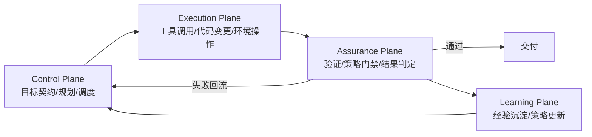
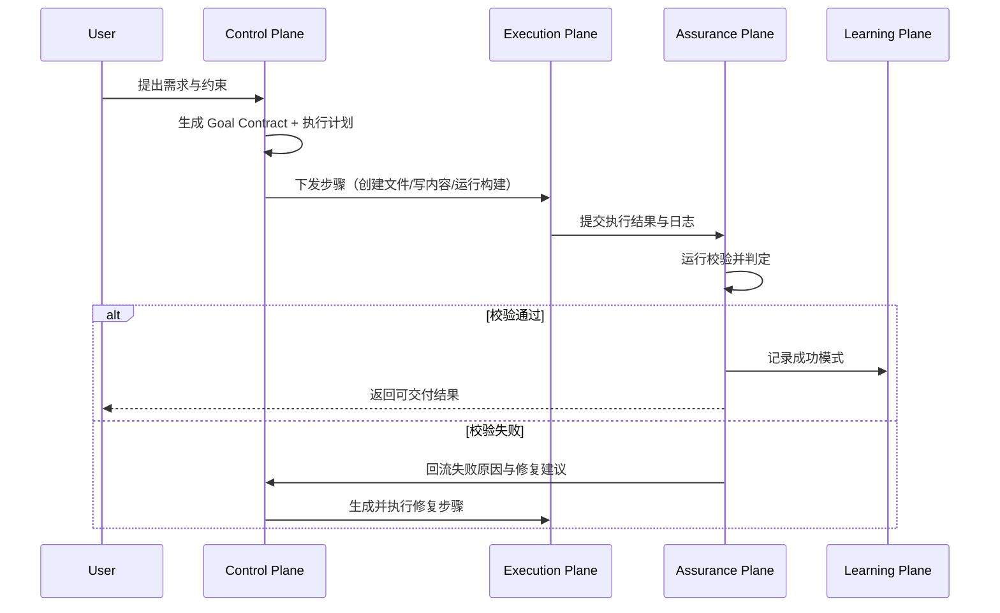

# 学习 OpenClaw 架构设计

如果只把 OpenClaw 理解成“一个更会写代码的 AI”，很容易学偏。它真正的难点在于架构：如何把目标定义、任务执行、结果验证、经验沉淀串成一个可闭环、可扩展、可治理的系统。

本文不讲提示词技巧，专注做一件事：**把 OpenClaw 的架构设计拆开看清楚**。

## 1. 架构目标先行：它到底在优化什么

OpenClaw 要解决的不是“单次回答质量”，而是“持续交付质量”。

核心目标：

- 用机器可执行的方式定义“完成”
- 让执行过程可观测、可回放、可复现
- 让验证自动化成为默认路径
- 让历史任务沉淀成下一次任务的加速器

这四个目标决定了它必须是分层架构，而不是单体 Agent。

## 2. 总体架构：四个 Plane

OpenClaw 可以拆成四个 Plane（平面）：

1. Control Plane（控制平面）
2. Execution Plane（执行平面）
3. Assurance Plane（保障平面）
4. Learning Plane（学习平面）



这就是 OpenClaw 的核心闭环：**规划 -> 执行 -> 验证 -> 学习 -> 再规划**。

## 3. 组件级架构拆解

### 3.1 Control Plane（控制平面）

职责：把“用户意图”变成“可执行计划”。

关键组件：

- Goal Contract Manager：生成目标契约（目标、边界、验收）
- Context Assembler：拼装上下文（代码、配置、历史）
- Planner：产出任务图（步骤、依赖、并行度）
- Scheduler：决定执行顺序和重试策略

设计重点：

- 契约优先：先定义验收，再规划步骤
- 小步分解：每个步骤都可独立验证
- 显式依赖：避免隐式顺序导致回归

### 3.2 Execution Plane（执行平面）

职责：执行计划中的具体动作，产出可验证结果。

关键组件：

- Tool Adapter：统一封装 Shell、Git、测试、构建、外部 API
- Workspace Operator：读写代码与配置
- Runtime State Tracker：记录每一步输入、输出、耗时、错误

设计重点：

- 工具抽象统一：屏蔽不同工具差异
- 执行可追踪：每一步都有证据链
- 幂等优先：失败可重试且副作用可控

### 3.3 Assurance Plane（保障平面）

职责：把“看起来完成”变成“可证明完成”。

关键组件：

- Validation Engine：执行 typecheck/lint/test/契约断言
- Policy Gate：策略门禁（安全、规范、发布规则）
- Decision Engine：通过/失败判定与回流路径

设计重点：

- 验证标准机器可执行
- 失败自动回流而不是人工硬兜底
- 结果分级：可修复失败 vs 阻断失败

### 3.4 Learning Plane（学习平面）

职责：把任务经验转成可复用资产。

关键组件：

- Episode Recorder：记录任务轨迹
- Pattern Miner：提取高频成功策略与失败模式
- Memory Index：按任务类型、语言、仓库结构做索引
- Policy Updater：把经验更新到规则与默认流程

设计重点：

- 结构化记录，避免“日志堆积但不可用”
- 抗污染：低质量经验不能直接覆盖默认策略
- 可回滚：策略更新必须可撤销

## 4. 关键链路拆解：一次需求如何流过系统

以“新增文章并验证可构建”为例：



这个链路体现了架构设计的关键点：

- Control Plane 不直接改代码，只负责决策
- Execution Plane 不负责判定正确性，只负责执行
- Assurance Plane 是发布前最后一道机器门禁
- Learning Plane 决定系统是否越跑越强

## 5. 接口契约拆解：层与层如何通信

下面是四个关键契约（简化版）：

### 5.1 GoalContract

```json
{
  "goal": "新增 OpenClaw 架构文章",
  "constraints": ["frontmatter 完整", "构建必须通过"],
  "acceptance": ["schema 校验通过", "pnpm build exit code = 0"]
}
```

### 5.2 PlanStep

```json
{
  "id": "step-3",
  "action": "run_command",
  "command": "pnpm build",
  "dependsOn": ["step-1", "step-2"],
  "retry": { "max": 1 }
}
```

### 5.3 ValidationReport

```json
{
  "status": "failed",
  "checks": [
    {"name": "build", "ok": false, "reason": "frontmatter schema mismatch"}
  ],
  "blocking": true,
  "next": "replan"
}
```

### 5.4 LearningRecord

```json
{
  "taskType": "content-update",
  "pattern": "先校验 schema 再 build 可减少返工",
  "confidence": 0.82,
  "scope": "astro-content"
}
```

架构价值在于：这些契约让系统行为从“隐式经验”变成“显式协议”。

## 6. 失败模式与架构防线

### 失败模式 1：规划漂移（Plan Drift）

症状：计划与目标逐步脱钩，做了很多事却不满足验收。

防线：

- Goal Contract 不可在执行中被静默修改
- 每步结束后做“目标对齐检查”

### 失败模式 2：执行非确定性

症状：同一计划多次执行结果不一致。

防线：

- 固定关键工具版本与命令参数
- 对非确定步骤保留重试与回放机制

### 失败模式 3：验证盲区

症状：构建通过但线上行为异常。

防线：

- 分层验证（静态 + 动态 + 契约）
- 把历史事故沉淀为回归用例

### 失败模式 4：学习污染

症状：错误经验被写入默认策略，导致连续失败。

防线：

- 学习记录分级（观察、候选、已验证）
- 只有“已验证”才能进入默认策略

## 7. 如何学习这套架构（实操路线）

### 阶段 1：先学 Control + Assurance

- 训练目标契约写法
- 为每类任务定义最小验证集

产出：你的任务契约模板与验证清单。

### 阶段 2：补齐 Execution 可观测性

- 给关键步骤加执行日志与状态快照
- 让失败可定位、可回放

产出：一套可追踪执行流水。

### 阶段 3：最后做 Learning 自动化

- 把复盘结果结构化
- 让经验自动参与下次规划

产出：v1 经验库与策略更新流程。

## 8. 总结

OpenClaw 的架构设计，本质不是“一个智能体怎么回答”，而是“一个系统如何稳定地产生可验证成果，并在循环中变强”。

如果你在学习这套架构，优先顺序建议是：

1. 先把目标契约和验证门禁做扎实
2. 再优化执行效率与并行度
3. 最后建设学习层，实现持续收益

先解决“对不对”，再解决“快不快”，这是 OpenClaw 架构落地最稳的路径。
