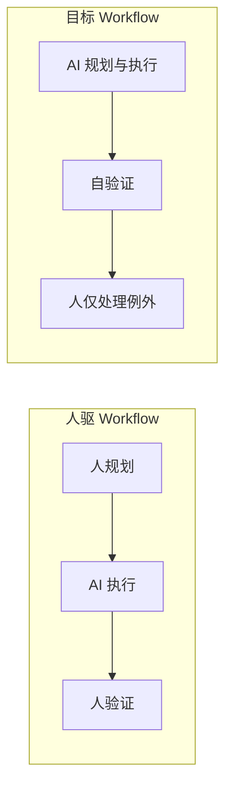

# AI Workflow

> 形成一套智能、强大、自动化的 AI Workflow

## 引言：从方法论到 Workflow

在前面的文章中，我们探讨了 **Prompt Engineering**、**Context Engineering** 以及 **MCP Engineering** 三种 AI 编码方法论。它们已经能够支撑日常开发的需求迭代：通过提示词优化、上下文工程和模型迭代，单次任务的质量可以做到不错。

但当前形态仍是「人驱动 AI、人设计流程、人验证结果」。瓶颈在哪？理想的 AI Workflow 应该具备哪些特征？本文是一次旅途中的头脑风暴：我们期望的，是**智能、可自验证、能积累经验**的 Workflow，而不是永远由人驱动、人验证。

## 现状：我们已能做什么（迭代）

提示词优化、上下文工程、模型迭代，已经基本满足日常开发的需求迭代。有了 MCP 与项目规则（Rules）之后，AI 能主动获取最新信息、按规范生成代码，需求从「描述」到「可运行实现」的效率明显提升。

小结：单次任务质量不错，但流程仍依赖人工设计与人工检查。谁来拆解需求、谁来定检查点、谁来判定「做完」，依然是人。

## 瓶颈：当前 Workflow 的局限性

**人驱为主**：流程、步骤、检查点都是人定的，AI 只执行，没有最大程度发挥「规划与决策」能力。依然是人去驱动 AI 干活，而不是 AI 在既定目标下自主规划与执行。

**缺少自学习**：高效工作流、可复用的 skills 仍靠人总结、人维护，AI 不参与沉淀与复用。还是人类去探索合理的工作流、整理高效的 skills，模型本身不会从历史任务中自动归纳「这类问题该怎么做」。

下面这张图概括了当前形态与目标形态的差异：

## 方向一：更「智能」的 Workflow

**AI 主导**：理想情况下，人类只去做 AI 无法接触到的物理世界工作（硬件、现场、权限授予等），其余由 AI 主导——规划、拆解、执行。目标与约束给人定，路径与步骤交给 AI。

**自学习**：Workflow 应具有自学习能力，从处理过的事情中总结经验（例如更新规则、沉淀 skills），便于后续同类任务自动复用。例如在 Cursor 里，把「提交前必须跑 typecheck、lint」写进 Rules，Agent 就会在改代码后自动执行这些检查；未来可以进一步让 AI 在多次类似任务后，归纳出可复用的 Skill，减少重复配置。

这里先点到为止，不展开实现细节；强调的是演进方向，而非当下必须一步到位。

## 方向二：可自验证的执行

来自 OpenClaw 创始人的观点很有启发性：**不要让人去验证，而是让 AI 制订一套可自验证的方法论**。程序或流程具备明确的正确性标准（断言、测试、检查清单），由 AI 自验、快速迭代，人只做例外处理或终审。

这与「测试驱动」「契约/规范」一脉相承：把「什么是正确」写清楚、可执行，AI 就能在闭环里自我纠错，而不是依赖人工逐行检查。

## 小结与展望

从「人驱 + 人验」到「AI 主导 + 自学习 + 自验证」，是 AI Workflow 的演进路径。工具与协议（如 MCP、Rules、Skills）会继续向「可执行、可观测、可沉淀」靠拢。我们需要的，正是一套智能、可自验证、能积累经验的 AI Workflow。
